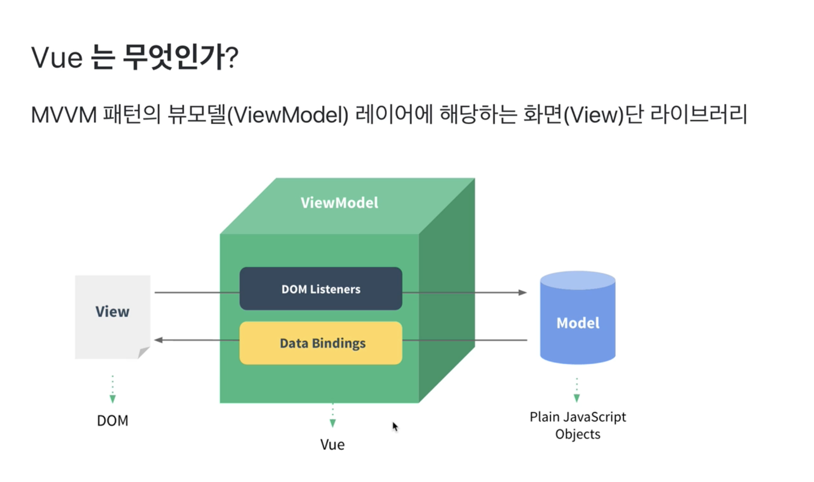

# learn-vue-js

[인프런 - Vue.js 시작하기](https://www.inflearn.com/course/Age-of-Vuejs/)  
[강의 리포](https://github.com/joshua1988/learn-vue-js)  

## 개발 환경 설정

### 단축키  
* VS Code 사이드바 Toggle : Command + \  
* Chrome 개발자 도구 Toggle : Command + option + I  


### Visual Code Plug-in  

* Vetur: Vue tooling for VS Code  
* Material Icon Theme: VS Code 아이콘을 Material 테마 아이콘으로 세팅해줌.  
* Night Owl: 코드 강조 플러그인
* Live Server: 로컬 서버
vue-cli를 배우기 전까지 일일히 html 파일을 생성하여 연습할 것이다. 이를 브라우저로 띄우지 않고, VS Code 내부의 서버를 통해 실행할 수 있도록 하는 것  
[Open with Live Server]를 통해 실행한다.  
파일이 수정될 경우, 자동으로 브라우저가 Refresh 되면서 반영된다.  
* ESLint
* Prettier
* Auto Close Tag: HTML/XML의 닫히는 태그를 자동으로 작성하게 해주는 플러그인  
~~느낌표를 작성 후 엔터를 클릭하면 전체 초기 Set이 입력되기도 한다.
만들고자 하는 태그와 아이디를 입력하면, 자동으로 입력해주기도 한다.~~ **이건 Emmet 이라는 VS Code 내장 플러그인이 해주는 것임**  
예시) ```div#app```입력 후 Enter를 치면 다음 내용이 자동으로 Set 된다.  
```
<div id="app">
</div>
```
* Atom Keymap  

### Vue 개발자도구 (Chrome Extension)

> Components, Vuex, Events 등의 기능으로 구성되어 있다.  

## Vue.js 소개

### MVVM 모델에서의 Vue

Vue.js 1.x 공식문서에 있는 이미지  
  

> Vue.js의 두 가지 큰 특징  
> **DOM Listeners**  
> **Data Bindings**

* View  
사용자에게 비춰지는 화면 (입력박스, 버튼 등)  
화면에 보여지는 요소들을 HTML  
DOM을 이용해서 JavaScript를 통해 조작을 할 수 있게 구성됨  

* DOM Listeners
화면에서 사용자가 이벤트를 조작했을 때, **DOM Listeners**를 통해 Vue에서 해당 이벤트를 청취하게 된다.  
그 후, JavaScript에 있는 데이터를 바꿔줌.  

* Data Bindings
JavaScript 데이터가 바뀌게 되었을 때, **Data Bindings**를 타게 된다.  
해당 변경된 내용을 Data Bindings를 통해 화면에 바로 반영되게 된다.  


### 기존 웹 개발 방식 (HTML, Javascript)

[playground/web-dev.html](./playground/web-dev.html) 파일 참고  

* HTML : 화면에 나타나는 태그나 DOM의 정보를 넣는다.  
* Javascript : 해당 태그나 DOM의 데이터를 조작하는 역할을 수행한다.  

```
        var str = 'Hello world';
        div.innerHTML = str;

        str = 'Hello world!!!';
        div.innerHTML = str;
```

내가 다루고 싶은 데이터 ```str```을 하나 선언하여 ```innerHTML``` 을 통해 조작을 한 후에,  
```str``` 변수의 값을 바꾸더라도, 바로 반영이 되지 않는다.  
한번 더 ```innerHTML```을 수행해서 다시 대입을 해주어야 반영이 된다.  


### Reactivity 구현  

[playground/vue-way.html](./playground/vue-way.html) 파일 참고  

> MDN(Mozilla Developer Network) : JavaScript 등의 기본 웹 기술에 관련한 기본 정보와 스펙을 관리하는 곳  
> 모든 문법과 예제를 보고 웹 개발을 하는 것이 좋다.  

[```Object.defineProperty()```](https://developer.mozilla.org/ko/docs/Web/JavaScript/Reference/Global_Objects/Object/defineProperty): 객체의 특정 속성의 동작을 재정의 하는 API  

**Vue의 핵심 Reactivity(반응성)**  

```
        var div = document.querySelector('#app');
        // div.innerHTML = 'hello world';
        var viewModel = {};

        //Object.defineProperty(대상객체, 객체의 속성, {정의할 내용})
        Object.defineProperty(viewModel, 'str', {
            // 속성의 접근했을 때의 동작 정의
            get: function() {
                // console.log(viewModel.str); 처럼 해당 속성에 접근했을 때

                console.log('접근');
            },
            // 속성에 값을 할당했을 때의 동작 정의 
            set: function(newValue) {
                console.log('할당', newValue);
                div.innerHTML = newValue;
            }
        })
```

```viewModel.str```에 값을 새로 할당할 때마다, ```innerHTML```을 통해 다시 반영해줄 필요 없이 바로 반영이 되는 것을 볼 수 있다.  
**데이터의 변화를 라이브러리에서 감지해서 알아서 화면에 자동으로 그려주는 것 -> Data Binding**  


### Reactivity 코드 라이브러리화 하기  

> 위의 defineProperty 부분을 라이브러리화 해보자.  
