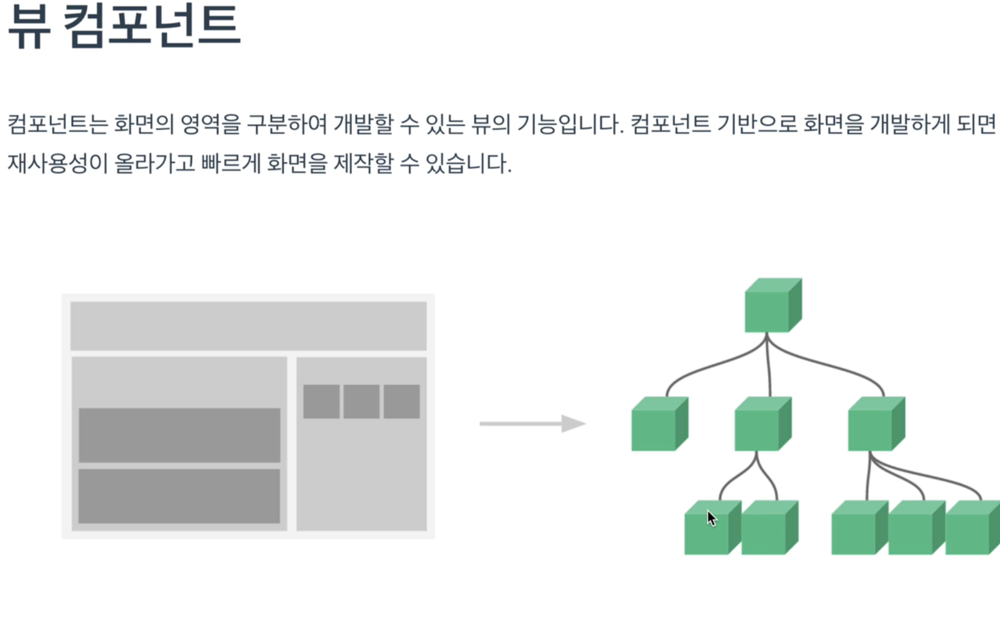
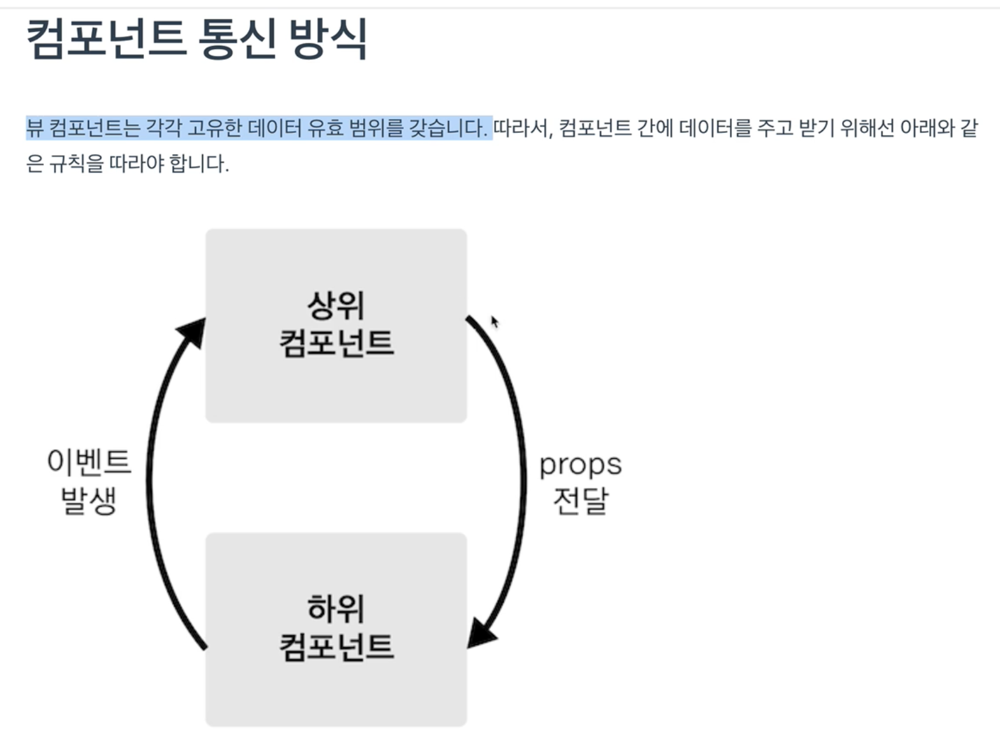
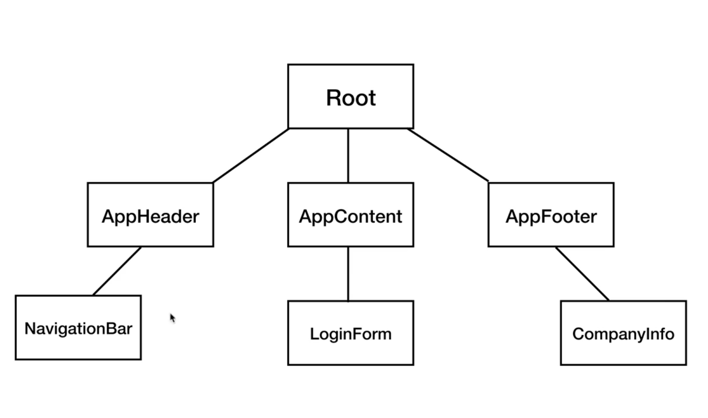
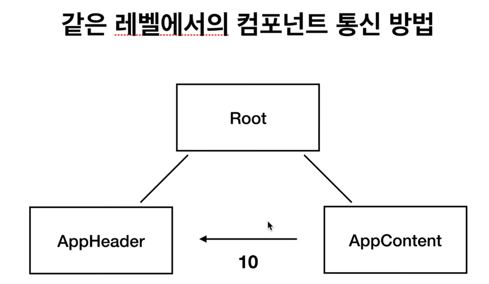

# learn-vue-js

[인프런 - Vue.js 시작하기](https://www.inflearn.com/course/Age-of-Vuejs/)  
[강의 리포](https://github.com/joshua1988/learn-vue-js)  

## 개발 환경 설정

### 단축키  
* VS Code 사이드바 Toggle : Command + \  
* Chrome 개발자 도구 Toggle : Command + option + I  


### Visual Code Plug-in  

* Vetur: Vue tooling for VS Code  
* Material Icon Theme: VS Code 아이콘을 Material 테마 아이콘으로 세팅해줌.  
* Night Owl: 코드 강조 플러그인
* Live Server: 로컬 서버
vue-cli를 배우기 전까지 일일히 html 파일을 생성하여 연습할 것이다. 이를 브라우저로 띄우지 않고, VS Code 내부의 서버를 통해 실행할 수 있도록 하는 것  
[Open with Live Server]를 통해 실행한다.  
파일이 수정될 경우, 자동으로 브라우저가 Refresh 되면서 반영된다.  
* ESLint
* Prettier
* Auto Close Tag: HTML/XML의 닫히는 태그를 자동으로 작성하게 해주는 플러그인  
~~느낌표를 작성 후 엔터를 클릭하면 전체 초기 Set이 입력되기도 한다.
만들고자 하는 태그와 아이디를 입력하면, 자동으로 입력해주기도 한다.~~ **이건 Emmet 이라는 VS Code 내장 플러그인이 해주는 것임**  
예시) ```div#app```입력 후 Enter를 치면 다음 내용이 자동으로 Set 된다.  
```
<div id="app">
</div>
```
* Atom Keymap  

### Vue 개발자도구 (Chrome Extension)

> Components, Vuex, Events 등의 기능으로 구성되어 있다.  

## Vue.js 소개

### MVVM 모델에서의 Vue

Vue.js 1.x 공식문서에 있는 이미지  
  

> Vue.js의 두 가지 큰 특징  
> **DOM Listeners**  
> **Data Bindings**

* View  
사용자에게 비춰지는 화면 (입력박스, 버튼 등)  
화면에 보여지는 요소들을 HTML  
DOM을 이용해서 JavaScript를 통해 조작을 할 수 있게 구성됨  

* DOM Listeners
화면에서 사용자가 이벤트를 조작했을 때, **DOM Listeners**를 통해 Vue에서 해당 이벤트를 청취하게 된다.  
그 후, JavaScript에 있는 데이터를 바꿔줌.  

* Data Bindings
JavaScript 데이터가 바뀌게 되었을 때, **Data Bindings**를 타게 된다.  
해당 변경된 내용을 Data Bindings를 통해 화면에 바로 반영되게 된다.  


### 기존 웹 개발 방식 (HTML, Javascript)

[playground/web-dev.html](./playground/web-dev.html) 파일 참고  

* HTML : 화면에 나타나는 태그나 DOM의 정보를 넣는다.  
* Javascript : 해당 태그나 DOM의 데이터를 조작하는 역할을 수행한다.  

```
        var str = 'Hello world';
        div.innerHTML = str;

        str = 'Hello world!!!';
        div.innerHTML = str;
```

내가 다루고 싶은 데이터 ```str```을 하나 선언하여 ```innerHTML``` 을 통해 조작을 한 후에,  
```str``` 변수의 값을 바꾸더라도, 바로 반영이 되지 않는다.  
한번 더 ```innerHTML```을 수행해서 다시 대입을 해주어야 반영이 된다.  


### Reactivity 구현  

[playground/vue-way.html](./playground/vue-way.html) 파일 참고  

> MDN(Mozilla Developer Network) : JavaScript 등의 기본 웹 기술에 관련한 기본 정보와 스펙을 관리하는 곳  
> 모든 문법과 예제를 보고 웹 개발을 하는 것이 좋다.  

[```Object.defineProperty()```](https://developer.mozilla.org/ko/docs/Web/JavaScript/Reference/Global_Objects/Object/defineProperty): 객체의 특정 속성의 동작을 재정의 하는 API  

**Vue의 핵심 Reactivity(반응성)**  

```
        var div = document.querySelector('#app');
        // div.innerHTML = 'hello world';
        var viewModel = {};

        //Object.defineProperty(대상객체, 객체의 속성, {정의할 내용})
        Object.defineProperty(viewModel, 'str', {
            // 속성의 접근했을 때의 동작 정의
            get: function() {
                // console.log(viewModel.str); 처럼 해당 속성에 접근했을 때

                console.log('접근');
            },
            // 속성에 값을 할당했을 때의 동작 정의 
            set: function(newValue) {
                console.log('할당', newValue);
                div.innerHTML = newValue;
            }
        })
```

```viewModel.str```에 값을 새로 할당할 때마다, ```innerHTML```을 통해 다시 반영해줄 필요 없이 바로 반영이 되는 것을 볼 수 있다.  
**데이터의 변화를 라이브러리에서 감지해서 알아서 화면에 자동으로 그려주는 것 -> Data Binding**  


### Reactivity 코드 라이브러리화 하기  

> 위의 defineProperty 부분을 라이브러리화 해보자.  

```init()``` 메소드와 ```render()``` 메소드로 분리하여 [Javascript의 즉시실행함수](https://github.com/yeoseon/tip-archive/issues/43) 안에 위치시키기  
다음과 같은 구조로 정의된다.  
```
        (function() {
            function init() {
                //Object.defineProperty(대상객체, 객체의 속성, {정의할 내용})
                Object.defineProperty(viewModel, 'str', {
                    // 속성의 접근했을 때의 동작 정의
                    get: function() {
                        // console.log(viewModel.str); 처럼 해당 속성에 접근했을 때
                        console.log('접근');
                    },
                    // 속성에 값을 할당했을 때의 동작 정의 
                    set: function(newValue) {
                        console.log('할당', newValue);
                        render(newValue);
                    }
                })

            function render(value) {
                div.innerHTML = value;
            }

            init();
        })();
```

* 즉시실행함수의 역할  
```init()```과 ```render()```가 외부에 노출되지 않게 또 다른 [Scope](https://github.com/yeoseon/tip-archive/issues/44)에 넣어준다.  
**일반적으로 오픈소스 라이브러리들은 이런 식으로 [변수의 유효범위](https://github.com/yeoseon/tip-archive/issues/44)를 관리하고 있다.**  


### Hello Vue.js와 뷰 개발자 도구  

> 위에서 구현했던 구조를 Vue.js를 통해서는 어떤 식으로 동작하는지 Helloworld 부터 시작해본다.  

[complete/getting-started/index.html](https://github.com/joshua1988/learn-vue-js/blob/master/getting-started/index.html) 파일 참고  

해당 파일을 [Open with Live Server]를 통해 띄워보자  

**Vue 개발자 도구**  
* Components  
Vue.js를 시작했을 때에 구성되는 기본적인 Component 구조도가 나옴  
message를 수정해줄 경우, 앞에서 구현한 Reactivity 로직이 내장되어 있어 화면에 바로 반영되는 것을 볼 수 있음.  

## 인스턴스  

### 인스턴스 소개  

[playground/instance.html](./playground/instance.html) 파일 참고  

Vue로 개발할 때 필수로 생성해야하는 개발 단위  
Vue가 여러 API과 속성을 제공하여 개발하기 쉽게 제공하고 있다.  

```
new Vue();
````

```#app```이라는 Tag를 찾아서 이 Vue 인스턴스를 붙히겠다는 선언  
이렇게 붙히는 순간, 해당 태그 안에서 Vue 관련 API와 속성을 사용할 수 있게 된다.  
element를 무조건 지정해줘야 한다.  
```
var vm = new Vue({
    el: '#app',
    data: {
        message: 'hi'
    }
});
```

### 인스턴스와 생성자 함수  

> 왜 인스턴스를 생성해서 사용하는지 생성자 함수와 함께 알아보자.  

기본적으로 Javascript를 이용하여 인스턴스를 생성하는 방법 중 하나 : 생성자 함수를 이용하는 것  

함수이름이 대문자로 시작한다 : 생성자 함수이다.  

```
function Person(name, job) {
    this.name = name;
    this.job = job;
}
```

```
var p = new Person('josh', 'developer');
```

Vue 생성자를 미리 정의해놓기
```
function Vue() {
    this.logText = function() {
        console.log('hello');   
    }
}
```

다음과 같이 미리 정의를 해놓으면, 우리가 Vue 인스턴스를 하나 생성할 때마다 위에 정의해놓은 기능이 장착되게 된다.  

```
var vm = new Vue();
```

매번 함수를 구햔하는 것이 아니라, 미리 이렇게 구현을 해놓을 수 있다.  
그래서 생성자 함수로 Vue에서 API와 속성을 미리 정의해놓고, 우리가 갖다 쓰거나 재사용하게 되는 패턴을 가지게 된다.  
이게 new Vue를 사용하는 이유이다.  

[생성자 함수 사용](https://developer.mozilla.org/ko/docs/Web/JavaScript/Guide/Obsolete_Pages/Core_JavaScript_1.5_Guide/Creating_New_Objects/Using_a_Constructor_Function) 참고  
[Prototype 설명 문서](https://developer.mozilla.org/ko/docs/Web/JavaScript/Reference/Global_Objects/Object/constructor) 참고  

### 인스턴스 옵션 속성  

> 생성자 함수로 재사용할 수 있는 옵션과 속성에 대해 알아보자.  

다음과 같은 속성과 API를 사용할 수 있다.  
**Vue 객체에 key-value 형태로 값이 관리된다는 점이 중요하다.**  
```
new Vue({
    el:,
    template:,
    data:,
    methods:,
    created:,
    watch:,
});
```

[playground/instance.html](./playground/instance.html) 파일 계속

```
var options = {
    el: '#app',
    data: {
        message: 'hi'
    }
 };

var vm = new Vue(options);
```

다음과 같이 별도의 변수를 선언하여 생성자 함수에 넣어주는 것도 좋지만, 위의 방법 처럼 **객체 리터럴** 방식을 사용하여 객체를 바로 넣어주는 것이 가독성에 있어서 더 좋다.  

[Javascript 객체 생성 방식](https://github.com/yeoseon/tip-archive/issues/47) 참고  

> 생성자 안에 들어가는 것은 **객체**이고, 해당 표기법을 사용해야 한다는 것을 인지한다.


## 컴포넌트  

### 컴포넌트 소개  

대부분의 모던 프레임워크는 이 컴포넌트를 기반으로 개발하고 있다.  

> 화면의 영역을 영역별로 분리하며 개발하는 것  

핵심: **재사용성**

 
영역을 구분했을 때, 컴포넌트 간의 관계가 생기게 된다. 

### [실습안내] 컴포넌트 등록 및 실습  

[playground/component.html](./playground/component.html) 파일 참고  

기본적으로 Vue 인스턴스를 생성하면 ```Root``` Component가 된다.

**전역 컴포넌트**를 등록하는 방법
```
Vue.component('컴포넌트 이름',컴포넌트 내용);
```
````
<body>
    <div id="app">
        <app-header></app-header>
    </div>
    
    <script src="https://cdn.jsdelivr.net/npm/vue/dist/vue.js"></script>
    <script>
        Vue.component('app-header',{
            template: '<h1>Header</h1>'
        });

        new Vue({
            el: '#app'
        });
    </script>
</body>
````

### [실습 풀이] 전역 컴포넌트 등록  

[playground/component.html](./playground/component.html) 파일 계속  

Root는 상위, 부모 컴포넌트의 역할을 수행한다.  
등록한 컴포넌트는 자연스럽게 Root의 하위 컴포넌트로 위치하게 된다.  

지금까지 전역 컴포넌트를 등록하는 방법을 해봤으나, 실제 서비스를 개발할 때에는 전역 컴포넌트를 선언하는 일이 거의 없을 것이다.  

다음 시간에 지역 컴포넌트를 살펴보도록 하자.  

### 지역 컴포넌트 등록  

[playground/component.html](./playground/component.html) 파일 계속  

서비스 개발시 가장 많이 쓰는 컴포넌트이다.  
다음과 같이 선언한다. 
```
new Vue({
    el: '#app',
    components: {
        '컴포넌트 이름(태그)': 컴포넌트 내용
    }
});
```

### 전역 컴포넌트와 지역 컴포넌트의 차이점 

지역 컴포넌트

* 특정 컴포넌트 하단에 어떤 컴포넌트가 등록이 되었는지 컴포넌트 속성으로 바로 알 수 있다.
* 따라서 서비스 개발시에는 components 속성 아래에 계속 등록해나가며 개발하는 방식을 사용한다.  

전역 컴포넌트  

* 실제 서비스 구현시에는 대부분 플러그인이나 라이브러리 형태로 전역으로 사용해야 하는 컴포넌트 형태만 사용하게 된다.  

### 컴포넌트와 인스턴스의 관계  

[playground/component.html](./playground/component.html) 파일 계속  

```new Vue()```를 통해 인스턴스 하나를 더 생성했을 경우 개발자 도구를 보면 Root Component가 하나 더 생기는 것을 확인할 수 있다.  
그리고 기존의 전역 및 지역 컴포넌트에 등록되어있는 컴포넌트 태그를 ```div#app2``` 에 붙혀넣기 하고 개발자도구를 살펴보면, 전역 컴포넌트만 나오고 지역 컴포넌트의 태그는 등록되지 않았다고 오류메시지를 뱉는다. 

전역 컴포넌트는 인스턴스를 생성할 때마다, 따로 등록하지 않아도 모든 인스턴스에 모두 등록이 된다.  
지역 컴포넌트는 인스턴스마다 컴포넌트를 따로 생성을 해줘야 한다.

> 실제로 전역 컴포넌트를 2개 이상 생성하는 일은 없다. 이해를 위한 예시임  

## 컴포넌트 통신 방법 - 기본  

### 컴포넌트 통신  

> 컴포넌트를 영역 별로 구분을 했을 때, 컴포넌트 사이에 관계가 생긴다.  
* 컴포넌트는 각각의 데이터를 갖는다.  
* 각 데이터를 컴포넌트 사이에서 공유를 하기 위해 props라는 속성과 이벤트 전달 방식을 이용해야 한다.  

  

* 상위에서 하위로는 데이터를 내려준다. (props 속성)
* 하위에서 상위로는 이벤트를 올려준다. (이벤트 발생)

### 컴포넌트 통신 규칙이 필요한 이유  

간단한 컴포넌트의 구조 예시  
각각 컴포넌트 하위에 컴포넌트를 하나 더 등록했을 경우
  

AppHeader 컴포넌트에서 특정 사용자가 로그인을 해서 LoginForm 컴포넌트에 데이터를 전달한다면?  
그 정보를 LoginForm에서 AppFooter로 전달을 한다면?  
이번에는 AppFooter에서 NavigationBar로 전달을 한다면?  

> 특정 컴포넌트의 변화에 따라 나머지 컴포넌트가 유기적으로 서로 데이터를 주고받았을 때, 이 관계가 복잡해진다면 데이터의 방향을 예측하기 어렵다. -> 버그를 추적하기가 어렵다 ([MVC패턴의 문제점](https://github.com/yeoseon/tip-archive/issues/53)

**Vue.js 에서는 데이터(props라는 속성의 데이터)가 상위에서 하위로만 내려가고, 하위에서 상위로는 이벤트가 발생되도록 통신하는 규칙을 가지고 있다.**  
> 데이터의 흐름을 추적할 수 있다. 

### props 속성

[playground/props.html](./playground/props.html) 파일 계속  

```
<body>
    
    <div id="app">
        <app-header></app-header>

    </div>

    <script src="https://cdn.jsdelivr.net/npm/vue/dist/vue.js"></script>
    <script>
        var appHeader = {
            template: '<h1>Header</h1>'
        }
        new Vue({
            el: '#app',
            components: {
                'app-header': appHeader
            },
            data: {
                message: 'hi'
            }
        })
    </script>
</body>
```

다음과 같이 작성하고 개발자도구를 확인해보면, **Root 컴포넌트 내에 message를 가지고 있는 것을 확인할 수 있다.** 

이를 Root 컴포넌트에서 app-header 컴포넌트로 해당 데이터를 내리고 싶을 때 ```props```를 사용한다. 
```
<app-header v-bind:프롭스 속성 이름="상위 컴포넌트 데이터 이름"></app-header>
```
즉 다음과 같이 정의한다.  
다음과 같이 정의하면 app-header 컴포넌트 내에 ```propsdata:'hi'```로 데이터가 전달되게 된다.  
```
<body>
    <div id="app">
        <app-header v-bind:propsdata="message"></app-header>

    </div>

    <script src="https://cdn.jsdelivr.net/npm/vue/dist/vue.js"></script>
    <script>
        var appHeader = {
            template: '<h1>Header</h1>',
            props: ['propsdata']
        }
        new Vue({
            el: '#app',
            components: {
                'app-header': appHeader
            },
            data: {
                message: 'hi'
            }
        })
    </script>
</body>
```

### props 속성의 특징 

위의 예제에서 Root의 ```message``` 의 데이터가 바뀌게 되면 해당 하위 컴포넌트인 app-header의 ```propsdata``` 데이터에도 반영된다. 

**데이터 바인딩**
```
var appHeader = {
    template: '<h1>{{ propsdata }}</h1>',
    props: ['propsdata']
}
```
다음과 같이 ```{{}}```를 통해 데이터 속성명을 넣어주게 되면 화면에 그대로 나타나게 된다.  

### [실습 안내] props 속성 실습 / 풀이

> 컴포넌트 별로 각각의 고유한 유효범위를 갖기 때문에, 컴포넌트 별로 속성명이 겹쳐도 관계 없이 쓸 수 있다. 

### event emit (이벤트 발생)  

아래에서 위로 컴포넌트의 신호를 보낼 때, 데이터를 다시 올리는 게 아니라 이벤트를 올린다.  

[playground/event-emit.html](./playground/event-emit.html) 참고  

> app-header에서 Root Component로 이벤트를 보내보자.  

$emit이라는 API를 이용해서 pass라는 이벤트를 발생시킨다.  
```
this.$emit('pass');
```

하위컴포넌트에서 emit한 pass라는 이벤트를 받아서 상위컴포넌트에 정의된 logText라는 methods를 실행시켰다.  
```
<div id="app">
        <app-header v-on:하위 컴포넌트에서 발생한 이벤트 이름 = "상위 컴포넌트의 메서드 이름"></app-header>
</div>

<div id="app">
        <app-header v-on:pass = "logText"></app-header>
</div>
```

### [실습 안내] event emit 실습  

appContent에서 Root로 event를 emit하여 10(this.num)에 1씩 더하도록 console창에 출력하기.  

data에 대해서 ```{{}}``` 를 이용하여 화면에 출력할 수 있다. data가 변경되는 즉시 반영되어 보여진다.  

### 뷰 인스턴스에서의 this  

```this```  

객체 안에서 다른 속성을 가리킬 때 this를 쓰면 해당 객체를 바라보게 된다.  

[this 관련 글 1](https://www.w3schools.com/js/js_this.asp)  
[this 관련 글 2](https://medium.com/quick-code/understanding-the-this-keyword-in-javascript-cb76d4c7c5e8)  
[JavaScript의 this](https://github.com/yeoseon/tip-archive/issues/84)  


## 컴포넌트 통신방법 - 응용  

### 같은 컴포넌트 레벨 간의 통신 방법  

AppContent와 AppHeader가 어떻게 통신하는가.  

  

### 같은 컴포넌트 레벨 간의 통신 방법 구현  

[playground/component-same-level.html](./playground/component-same-level.html) 참고

같은 컴포넌트 사이의 통신은 막혀있다.  

그래서 event emit을 통해 상위 컴포넌트로 올렸다가, 상위 컴포넌트에서 도착 컴포넌트로 props로 내려주면 된다.  

Root 에서 appHeader로 props를 내리려면 data를 선언해주어야 한다.  

  

## 라우터  

### 뷰 라우터 소개와 설치  

뷰에서 싱글 페이지 애플리케이션을 구현하거나 화면을 이동할 때 사용되는 라이브러리  
Vue.js에서 공식 라이브러리로 관리하고 있다.  


[라우터 공식 사이트 설치 문서 링크](https://router.vuejs.org/installation.html)  

[playground/router.html](./playground/router.html) 참고  

### 뷰 라우터 인스턴스 연결 및 초기 상태 안내  

뷰 라우터를 Vue 인스턴스에서 사용시켜보자.  

```$route```가 생기는 것을 개발자 도구에서 볼 수 있다.  
= router가 Vue 인스턴스(Root)에 **주입이 되었다고 한다.**  

### [실습 안내] routes 속성 설명 및 실습 안내  

* ```routes``` : 페이지의 라우팅 정보가 배열로 들어간다.(어떤 url로 들어갔을 때 어떤 페이지가 뿌려질지의 정보). 페이지의 개수만큼 객체가 필요하다.  
    * ```path```: 페이지의 url  
    * ```component```: 해당 url에서 표시될 Component  

**라우터 뷰**  
접속하는 url에 따라서 페이지가 달라지는 영역  
```<router-view></router-view>```로 정의한다.  
이 태그는 반드시 Vue 인스턴스에 router를 연결해야지만 사용할 수 있다.  

router로 설정한 url(```/login```)으로 접속해보면 ```<router-view></router-view>``` 안에 표현된다.  

### 링크를 이용한 페이지 이동 및 router-link 태그 설명  

일일히 url를 바꿔 접속하지 않고, 화면에서 link 이동을 제공할 수 있도록 기능한다.  
```<router-link to="[url]"></router-link>``` 를 통해 입력하면 최종적으로 화면에서는 ```<a href=""></a>``` 태그로 변환되어 나타난다.

### 라우터 정리 및 학습 방향 안내  

* 라우터 : 페이지를 이동할 때 사용하는 Vue 공식 라이브러리이자 기능이다.  

* 추가적으로 살펴볼 내용들 : 라우터 인증, 네비게이션 가드 ...  

[네비게이션 가드 내용 참고](https://joshua1988.github.io/web-development/vuejs/vue-router-navigation-guards/)  


## HTTP 통신 라이브러리 axios  

### HTTP 라이브러리와 Ajax 그리고 Vue Resource  

* Ajax  
    * 비동기적인 웹 애플리케이션 제작을 위한 웹 개발 기법   
    * 변경하고 싶은 데이터만 서버에서 받아와서 갈아 껴주는 개념  
    * SPA 페이지 제작이 쉬워졌다.  

* [Vue Resource](https://github.com/pagekit/vue-resource)    
    * 예전 Vue 공식 HTTP 클라이언트 라이브러리  
    * 2년 전에 관리하지 않기로 함.  
    * Vue Resource 관련 샘플들은 오래되었을 소스코드일 가능성이 많으니 참고할 것  

### axios 소개 및 오픈 소스를 사용하기 전에 알아야 할 것들  

[axios github](https://github.com/axios/axios)  

Vue에서 권고하고 있는 HTTP 통신 라이브러리  

Promise 기반의 HTTP 통신 라이브러리  

다른 라이브러리에 비해 문서화가 잘 되어 있고 API가 다양하다.  

Promise(Javascript 비동기 처리 패턴 중 하나) based HTTP client for the 

* [Javascript 비동기 처리 패턴](https://joshua1988.github.io/web-development/javascript/javascript-asynchronous-operation/)    
    1. callback
    2. [promise](https://joshua1988.github.io/web-development/javascript/promise-for-beginners/)
    3. promise + generator 
    4. [async & await](https://joshua1988.github.io/web-development/javascript/js-async-await/)

* 오픈 소스 이용하는 방법  
    * star 수가 많을 수록 좋다.  
    * commits, contributors 수를 보면 좋다.  
    * 라이브러리가 언제 수정이 되었는 지 확인한다.  

### axios 실습 및 this 설명  

promise를 익혀야 then-catch 문을 이해할 수 있다.  

axios.get을 처리하기 전에 ```var vm```으로서 부르는 this와   
axios.get을 비동기 처리에 의해서 들어오는 콜백함수의 this가 다르다.  

전자는 Component를 바라보고,  
후자는 비동기 처리를 했을 때 실행 Context가 바뀌면서 바뀐다.  

[javascript 동작원리 참고](https://joshua1988.github.io/web-development/translation/javascript/how-js-works-inside-engine/)  

```console.log```로 찍어보자 !  

```
new Vue({
    el: '#app',
    data: {
        users: []
    },
    methods: {
        getData: function() {
            var vm = this;
            axios.get('https://jsonplaceholder.typicode.com/users/')
                .then(function(response) {
                    console.log(response.data);
                    vm.users = response.data;
                    //이 안에서 호출하는 this와 위의 vm의 this가 다르다.
                })
                .catch(function(error) {
                    console.log(error);
                });
        }
    }
})
```

### 웹 서비스에서의 클라이언트와 서버와의 HTTP 통신 구조  

브라우저에서 axios를 이용하여 HTTP 프로토콜을 통해 통신하는 구조.  


* 브라우저(Client)와 서버(Server)가 HTTP를 주고 받는 구조 - 요청과 응답  
    1. 브라우저에서 HTTP 요청(request)이 서버로 날라간다.  
    2. 서버의 요청을 받아 내부적인 특정 백엔드 로직을 통해서 DB의 데이터를 꺼내온다.  
    3. 데이터 결과물을 HTTP 응답(response)으로 브라우저로 돌려준다.


### 크롬 개발자 도구 네트워크 패널 보는 방법  

XHR: 통신을 볼 수 있다 ! 
Headers: 특정 요청 및 응답에 대한 부가적인 정보  

[프런트엔드 개발자가 알아야 하는 HTTP 프로토콜](https://joshua1988.github.io/web-development/http-part1/)  
[구글 크롬 개발자도구 공식 문서](https://developers.google.com/web/tools/chrome-devtools/)  

## 템플릿 문법 기본  

### 템플릿 문법 소개 : 데이터 바인딩과 디렉티브  

* 데이터 바인딩  
    * 콧수염 괄호(Mustache tag)  
* 디렉티브  
    * HTML 태그에서 ```v-```라는 속성으로 사용되는 태그  
    * 이게 붙으면 Vue에서 모두 인식해서 내부적으로 돌아간다.  

### 데이터 바인딩과 computed 속성  

[playground/data-binding.html](./playground/data-binding.html) 참고 

값을 바꾸는 즉시 반영되는 것 : reactivity  
값을 바꾸기 위한 통신 : 데이터 바인딩  

```computed 속성``` : 기존에 선언된 data를 이용해 어떠한 처리를 하고 싶을 때 사용한다. 기존 선언된 data의 값이 바뀌면 해당 속성을 통해 같이 처리된다.  

```
computed: {
    doubleNum: function() {
        return this.num * 2;
    }
}    
```
### [실습 안내] 뷰 디렉티브와 v-bind  

```v-```가 붙는 특수한 속성들  

[playground/data-binding.html](./playground/data-binding.html) 참고  

```
<p v-bind:id="uuid">{{ num }}</p>
<p id="abc1234">{{ num }} </p> 과 같다.  
```

**Vue에서 관리하는 data가 바뀌면, 화면에서 보이는 텍스트 뿐만 아니라, HTML DOM 까지 연결하여 reactivity로 바꿔준다.**  

### [실습 풀이] 클래스 바인딩, v-if, v-show  

class 역시 binding을 통해 변경 가능하다.  

```v-if``` 활용 : 조건에 따라 특정 tag의 내용을 보여주느냐, 안보여주느냐  
```
<div v-if="loading">
    <!-- user가 로그인 하기 전의 상태 -->
    Loading... 
</div>
<div v-else>
    <!-- user 로그인 완료 -->
    test user has been logged in  
</div>
```

```v-show``` 활용 : ```v-if```와의 차이  
```v-if```는 DOM을 아예 제거. ```v-show```는 ```display:none;``` 처리

### 모르는 문법이 나왔을 때 공식 문서를 보고 해결하는 방법  

[playground/data-binding.html](./playground/data-binding.html) 참고 

**처음에는 공식 문법을 보면서 구현하며 연습하자.  
스스로 해결해나갈 수 있는 능력을 키우자.**  

> TODO: 인풋 박스를 만들고 입력된 값을 p 태그에 출력해보세요.  

[Form Input Binding 공식 문서](https://vuejs.org/v2/guide/forms.html#ad)를 참고한다.  

```
<input v-model="message" placeholder="edit me" type="text">
<p>
    Message is: {{message}} 
</p>
```

### methods 속성과 v-on 디렉티브를 이용한 키보드, 마우스 이벤트 처리 방법  

[playground/methods.html](./playground/methods.html) 참고 

```
<button v-on:click="메서드 이름"></button>
```
```
keypress 도 가능
<input type="text" v-on:keyup="메서드 이름">
```

event modifier (공식문서 참고)  
```
enter를 입력했을 때만 logText를 실행하겠다.  
<input type="text" v-on:keyup.enter="logText">
```

## 템플릿 문법 실전  


